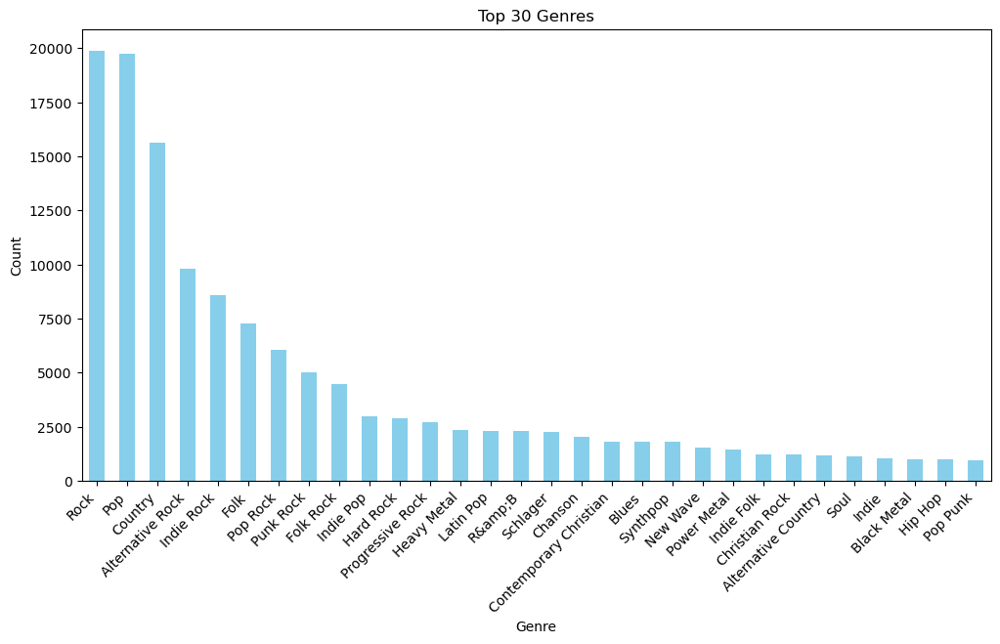
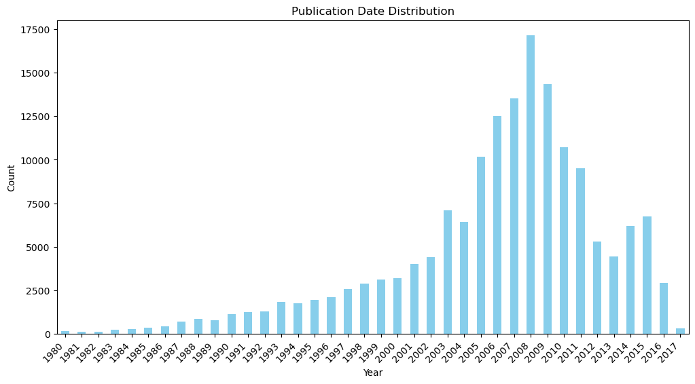
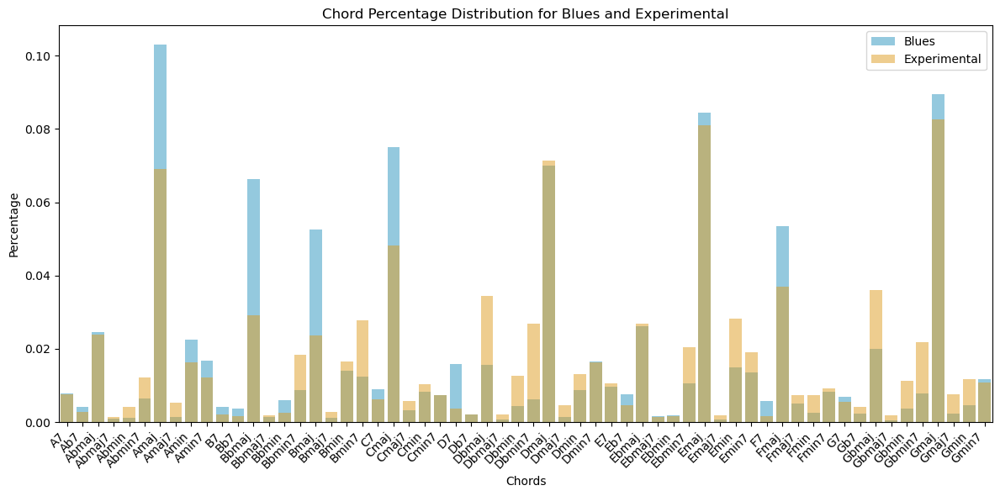
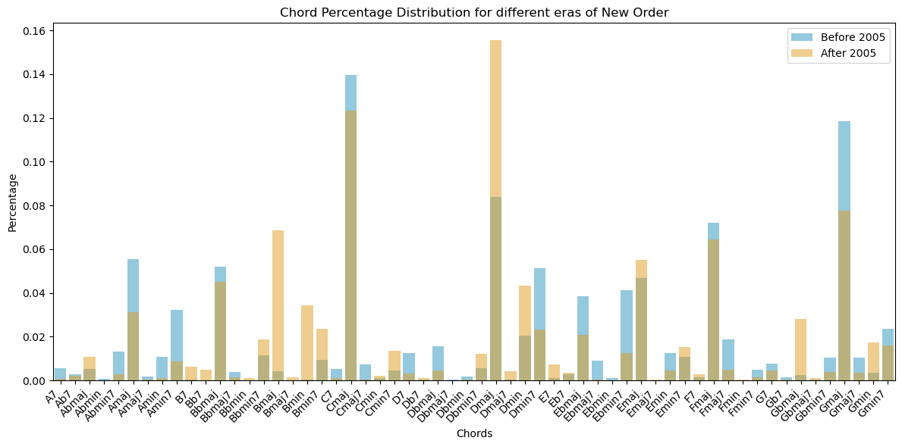
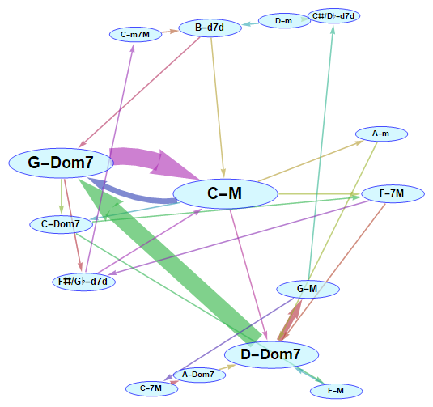
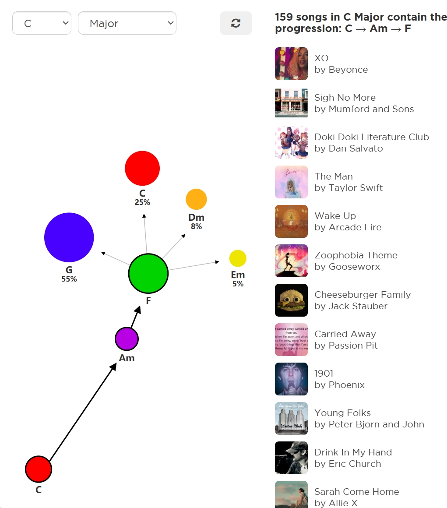

# Project of Data Visualization (COM-480)

| Student's name | SCIPER |
| -------------- | ------ |
|Yiwei Liu|369958|
|Ewan Golfier|282528|
|Tianhao Dai|369945|

[Milestone 1](#milestone-1) • [Milestone 2](#milestone-2) • [Milestone 3](#milestone-3)

## Milestone 1 (21st March, 5pm)

## Dataset

We use the Wasabi Song Corpus ([Zenodo record](https://zenodo.org/records/5603369)), a large-scale dataset containing metadata and analytical information for approximately 2 million commercially released songs prior to the 2020s. In addition to traditional metadata (e.g., song, album, and artist information), the dataset includes richer, automatically extracted features—such as emotion labels derived from lyrics using BERT-based models, and topic distributions obtained via Latent Dirichlet Allocation (LDA).

## Problem Statement

The core objective of this project is to visualize chord progression patterns in music.  Chord progression refers to the sequence in which musical chords are played—typically reflecting the harmonic structure of a song. To represent these patterns, we propose using a directed graph: each node represents a chord, and each edge indicates a transition from one chord to another. The graph will allow users to explore how chords tend to follow each other in different musical contexts.

Graphs are a natural choice for modeling chord progression for several reasons:
- They capture both chord usage frequency (node-level statistics) and transition likelihoods (edge-level statistics).
- Their flexible visual encoding enables the use of node size, shape, and color to represent musical features (e.g., major/minor mode, genre specificity), while edge thickness and color can convey the strength and type of transitions.

More broadly, our motivation is to understand how harmony—the language of chords—varies across musical styles, cultures, and eras. For example: Do chord progressions differ systematically between pop and jazz? How did harmonic practices evolve from the 1980s to the 2010s? Are there links between a song's emotional feel (captured via BPM, gain, and lyric-based sentiment) and its harmonic structure?

While such questions can be addressed statistically, a visual representation offers greater flexibility and engagement. With interactive filtering, users can define and compare arbitrary subgroups (e.g., British alternative rock vs. American R&B) and immediately observe differences in harmonic tendencies—reflected in the size and connections of nodes and edges in the graph.

This project is designed for users of all levels of musical literacy—from music theory learners seeking intuitive insights into harmony, to composers and producers looking for inspiration, to researchers analyzing stylistic patterns at scale.

## Exploratory Data Analysis

The raw Wasabi dataset is provided in JSON format, which we converted to column-based formats (CSV and Parquet) more suitable for analysis. The raw converted files are hosted in a [HuggingFace repository](https://huggingface.co/datasets/thdai2000/wasabi_raw). We further selected relevant columns, merged necessary data (songs, albums, and artists), and prepared cleaned versions for downstream analysis. These processed files are stored in the `/proc` fold of the HuggingFace repository.

These curated files include:
- `song.parquet`: song-level features including title, release date, genre, chord progression, BPM, gain, emotion labels, and topic distributions.
- `artist.csv`: artist metadata including name, country, and group/person type.
- `album.csv`: album-level features including release year, genre, and country.

We filtered the dataset using the following criteria:
- Chord extraction confidence > 0.7 (median confidence is 0.72)
- Duration between 10 seconds and 10 minutes

After filtering, we retain 292,000 songs, of which approximately 180,000 have genre labels.

### Genre and Time Distribution

There are 368 unique genre labels. The chart below shows the top 30 most frequent genres:

Most of the songs in our dataset fall under popular music styles and were released between 1980 and 2017:

This diversity across genres and decades provides a rich landscape for harmonic analysis.

### Chord Frequency

We examined the quality and distribution of chord data by comparing genres and time periods:

- The plot below compares chord usage frequency in Blues vs. Experimental music. We observe that Blues tends to rely more on traditional major chords, while Experimental music uses more unconventional or dissonant chords.

    

- The following figure compares chord usage in the band New Order before and after 2005. Notably, the use of Bmaj and Dmaj increased after 2005, while Gmaj and Amaj usage declined.

    

While bar plots can highlight broad trends in chord usage, they do not capture transitional information—how one chord moves to another. Therefore, we propose using graph-based visualization to represent chord progression patterns in a way that is more dynamic, intuitive, and musically meaningful.

## Related Work

In the [original Wasabi dataset paper](https://hal.science/hal-03282619/document), M. Buata et al. envision various visualization possibilities, such as artist distribution and collaboration networks. However, their work does not focus on harmony or chord progression.

Several existing projects have attempted to visualize chord progressions:

- A [Wolfram blog post](https://community.wolfram.com/groups/-/m/t/1383630) introduces a technique for visualizing chord transitions in Bach’s Prelude No. 1, where chords are nodes and arrow thickness represents transition frequency.

    

  This approach is designed for single-song visualization using symbolic MIDI data, whereas our work generalizes the idea to groups of songs using algorithm-extracted chord data at scale.

- The [Hooktheory project](https://www.hooktheory.com/trends) provides an interactive tool where users select a key and explore common chord progressions via a clickable bubble interface. The size of each bubble corresponds to the likelihood of the next chord, and songs matching the progression are listed.

    

Our approach differs by emphasizing filtering and comparison across fine-grained categories (genre, era, artist, country, etc.), as well as the scalability to large datasets rather than individual songs.

The result is a visualization that is both musically insightful and data-driven, offering users a powerful interface to explore the harmonic fabric of modern music.

## Milestone 1 (21st March, 5pm)

**10% of the final grade**

This is a preliminary milestone to let you set up goals for your final project and assess the feasibility of your ideas.
Please, fill the following sections about your project.

*(max. 2000 characters per section)*

### Dataset

> Find a dataset (or multiple) that you will explore. Assess the quality of the data it contains and how much preprocessing / data-cleaning it will require before tackling visualization. We recommend using a standard dataset as this course is not about scraping nor data processing.
>
> Hint: some good pointers for finding quality publicly available datasets ([Google dataset search](https://datasetsearch.research.google.com/), [Kaggle](https://www.kaggle.com/datasets), [OpenSwissData](https://opendata.swiss/en/), [SNAP](https://snap.stanford.edu/data/) and [FiveThirtyEight](https://data.fivethirtyeight.com/)), you could use also the DataSets proposed by the ENAC (see the Announcements section on Zulip).

### Problematic

> Frame the general topic of your visualization and the main axis that you want to develop.
> - What am I trying to show with my visualization?
> - Think of an overview for the project, your motivation, and the target audience.

### Exploratory Data Analysis

> Pre-processing of the data set you chose
> - Show some basic statistics and get insights about the data

### Related work

> - What others have already done with the data?
> - Why is your approach original?
> - What source of inspiration do you take? Visualizations that you found on other websites or magazines (might be unrelated to your data).
> - In case you are using a dataset that you have already explored in another context (ML or ADA course, semester project...), you are required to share the report of that work to outline the differences with the submission for this class.

## Milestone 2 (18th April, 5pm)

The deliverables for milestone 2 can be found here:
> website:
> report: 

## Milestone 3 (30th May, 5pm)

**80% of the final grade**

## Late policy

- < 24h: 80% of the grade for the milestone
- < 48h: 70% of the grade for the milestone

